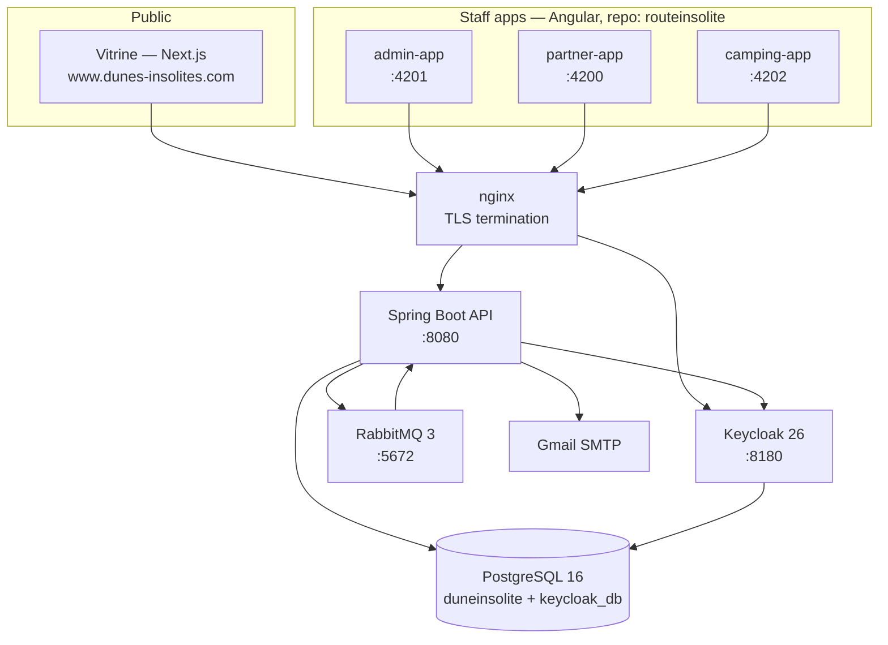
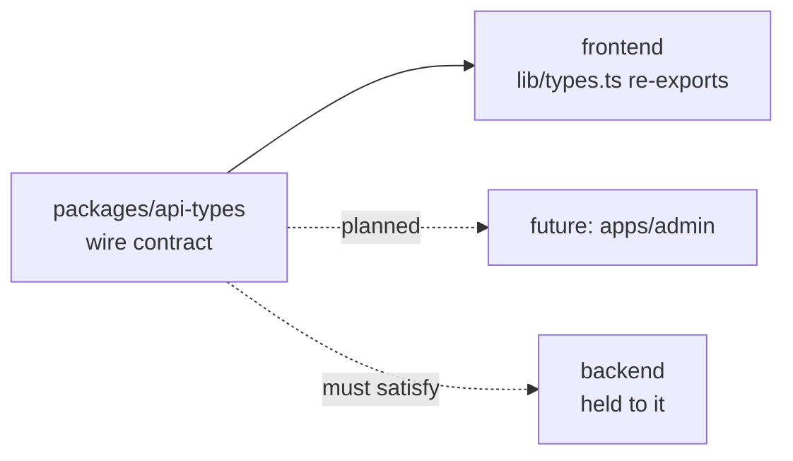
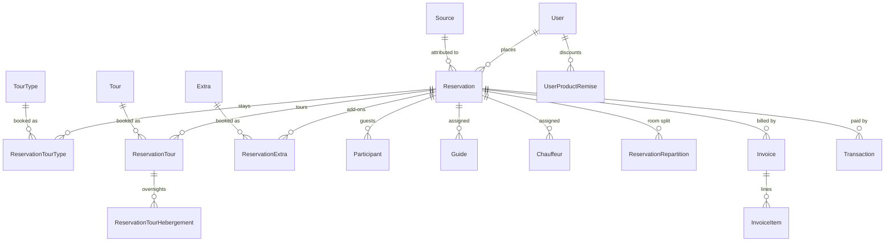
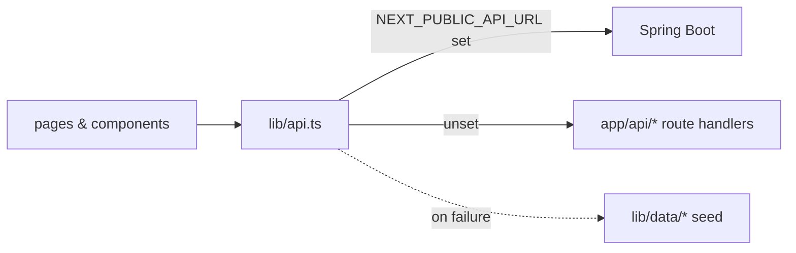
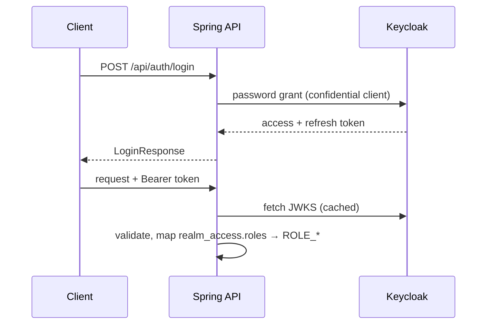
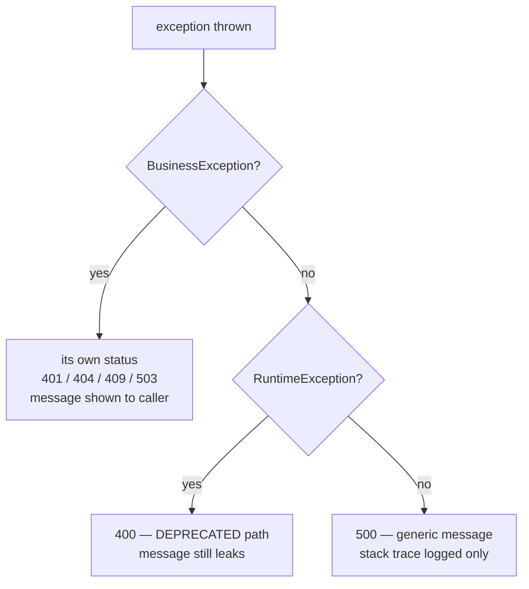
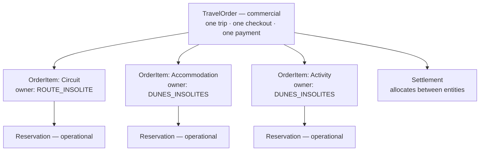
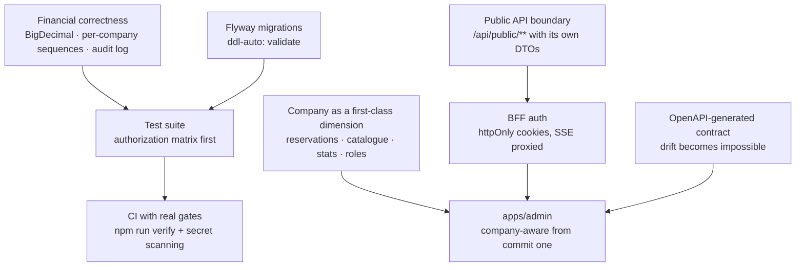

# Architecture

Reference for the Dunes Insolites platform: what the pieces are, why they are
arranged this way, and where the known weaknesses are.

Kept honest on purpose. A document that only describes the good parts is worse
than no document, because it makes the debt invisible to whoever reads it next.

**Last verified:** 25 August 2026, against commit `12eeac5`.

---

## Contents

1. [The business](#1-the-business)
2. [System topology](#2-system-topology)
3. [Repository layout](#3-repository-layout)
4. [The contract layer](#4-the-contract-layer)
5. [Backend](#5-backend)
6. [Frontend](#6-frontend)
7. [Identity and authorization](#7-identity-and-authorization)
8. [Error semantics](#8-error-semantics)
9. [Money and documents](#9-money-and-documents)
10. [Build and verification](#10-build-and-verification)
11. [Key decisions](#11-key-decisions)
12. [Known architectural debt](#12-known-architectural-debt)
13. [Target architecture](#13-target-architecture)

---

## 1. The business

Two **separate legal entities** share one platform. This is the single most
important thing to understand before reading any of the code, because it
explains structure that otherwise looks arbitrary.

| | Dunes Insolites | Route Insolite |
|---|---|---|
| **What it sells** | Overnight stays (*nuitées*) at the Sabria camp, plus on-site activities | Multi-day Sahara circuits departing Djerba, Tozeur, Tataouine |
| **Registered at** | El Faouar 4264, Kébili | Boulevard 11 Janvier, Houmet Souk, Djerba 4180 |
| **Public site** | `www.dunes-insolites.com` | `www.route-insolite.com` |
| **Enum value** | `CompanyType.DUNES_INSOLITES` | `CompanyType.ROUTE_INSOLITE` |

They are not competitors. The agency sells circuits that **overnight at the
camp** — which is why `ReservationTourHebergement` exists, and why a single
shared database is the right call rather than two systems reconciling with each
other.

The company distinction currently exists in exactly **one** place: a flag on
`Invoice`, which selects the logo, stamp image and legal footer on generated
PDFs. See [§12](#12-known-architectural-debt) for why that is not enough.

---

## 2. System topology



**Deployment.** Everything runs under `docker-compose.yml` in `backend/`. Every
internal service binds to `127.0.0.1` only — Postgres, Keycloak, RabbitMQ and
the API are unreachable from outside the host, and nginx is the sole ingress.
This is deliberate and should be preserved.

**One Postgres instance, two databases:** `duneinsolite` for the application,
`keycloak_db` for identity. Created by `docker/init-keycloak-db.sql`.

**RabbitMQ** carries notification fan-out. Consumers use manual acknowledgement
with retry (3 attempts, 5 s initial interval, ×2 multiplier), so a failed
handler does not silently drop a notification.

---

## 3. Repository layout

One repository, one branch (`main`), two histories preserved via subtree merge.

```
dunes insolites/
├── package.json            npm workspaces root — one `verify` gate
├── package-lock.json       single lockfile for the whole workspace
├── ARCHITECTURE.md         this file
│
├── packages/
│   └── api-types/          the wire contract — imported by every frontend
│
├── frontend/               @dunes/frontend — espace client (Next.js)
├── backend/                Spring Boot API + docker-compose
├── scripts/mvn.mjs         cross-platform Maven dispatch
├── design/                 design handoff + brand assets
└── docs/                   planning documents
```

**Why a monorepo.** The frontend and backend previously lived in separate
repositories with the API contract described in a Markdown file. They drifted
until they modelled entirely different domains — the site called `/activities`
and `/stays` while the API served `/tours` and `/reservations`, with **no
overlapping endpoint at all**, and nothing detected it. The contract now lives
in code both sides import, so drift is a compile error rather than a discovery.

**Not yet in place:** task caching (Turborepo/Nx), CI. `npm run verify` is the
gate; it is simply not wired to a pipeline yet.

---

## 4. The contract layer

`packages/api-types` is the single definition of what crosses the network.



**Rules for that package:**

1. **Only shapes that travel over the wire.** No view models.
2. **Only rules both sides must agree on.** `MAX_PARTY_SIZE` lives there because
   the client validates against it and the server enforces it; if they disagree,
   bookings fail in a way neither side can explain.
3. **Changing it is a breaking change for two applications.** Treat it as an API
   version bump.

`frontend/lib/types.ts` re-exports the contract — so every existing
`@/lib/types` import keeps working — and keeps only **presentation**:
`SLOT_LABELS`, `REVIEW_SOURCE_LABELS`. That split matters: those become
translated strings when `next-intl` lands, and translations have no business in
a contract shared with a Java service.

> The contract is currently **shared**, which catches drift at compile time.
> Generating it from the backend's OpenAPI spec would make it **derived**, which
> prevents drift entirely. That is the next rung — see [§13](#13-target-architecture).

---

## 5. Backend

Spring Boot 4.0.3 · Java 21 · ~12,500 LOC · 19 controllers.

### 5.1 Layering

```
controller/     HTTP boundary. @PreAuthorize lives here. Returns DTOs.
   ↓
service/        Interfaces — the domain's vocabulary.
service/impl/   Implementations. Transactions, business rules.
   ↓
repository/     Spring Data JPA. Specifications for dynamic queries.
   ↓
model/          JPA entities. Never leave the service layer.
```

Supporting packages:

| Package | Role |
|---|---|
| `dto/request` · `dto/response` | Wire shapes. Separate types per direction, deliberately. |
| `mapper/` | MapStruct. Entity ↔ DTO, compile-time generated. |
| `exception/` | Typed failures + `GlobalExceptionHandler`. |
| `config/` | Security, CORS, Keycloak admin, RabbitMQ, currency, seeding. |
| `dto/statistics` | Dashboard projections — read models, not entities. |

**The rule that matters:** entities never cross the controller boundary. One
violation remains — `AuthController.register` returns `User` — and is tracked in
[§12](#12-known-architectural-debt).

### 5.2 Domain model



**Catalogue.** `TourType`, `Tour` and `Extra` share nearly the same shape:
`programSteps` (day-by-day itinerary), `duration` as free text, `location`,
`languages`, `cancellationPolicy`, `highlights`, `includedItems`, photos, and
**four prices** — passenger and partner × adult and child. That is a tour
operator's model, and it is the reason the platform can carry Route Insolite's
multi-day circuits at all.

**`Reservation` is the aggregate root**, and it is doing a great deal:

- Discriminated by `ReservationType`: `HEBERGEMENT` | `TOURS` | `EXTRAS`
- Lifecycle: `PENDING → CONFIRMED → CHECKED_IN → COMPLETED`, with `CANCELLED`
  and `REJECTED` as terminal states
- Soft-deleted via `deletedAt`
- Owns stays, tours, extras, participants, staff assignment, room distribution,
  invoices and transactions

This breadth is why `ReservationServiceImpl` is 1,788 lines. See
[§12](#12-known-architectural-debt).

### 5.3 Enumerations

| Enum | Values |
|---|---|
| `UserRole` | `CLIENT` · `PARTENAIRE` · `CAMPING` · `ADMIN` |
| `ReservationStatus` | `PENDING` · `CONFIRMED` · `CHECKED_IN` · `CANCELLED` · `REJECTED` · `COMPLETED` |
| `ReservationType` | `HEBERGEMENT` · `TOURS` · `EXTRAS` |
| `CompanyType` | `DUNES_INSOLITES` · `ROUTE_INSOLITE` |
| `InvoiceType` | `STANDARD` · `PROFORMA` · `CREDIT_NOTE` |
| `InvoiceStatus` | `DRAFT` · `SENT` · `CANCELLED` |
| `PaymentStatus` | `UNPAID` · `PARTIALLY_PAID` · `PAID` · `OVERDUE` · `REFUNDED` |
| `TransactionStatus` | `PENDING` · `COMPLETED` · `FAILED` · `REFUNDED` · `CANCELLED` |
| `Currency` | `TND` · `EUR` · `USD` |
| `ProductType` | `TOURTYPE` · `TOUR` · `EXTRA` |
| `LoyaltyTier` | `BRONZE` · `SILVER` · `GOLD` · `PLATINUM` |

### 5.4 Asynchronous work

Notifications are published to RabbitMQ and consumed back into the application,
which fans them out to connected clients over **Server-Sent Events**
(`GET /api/notifications/subscribe`).

SSE has one awkward constraint: the browser `EventSource` API cannot set an
`Authorization` header. `SecurityConfig.bearerTokenResolver()` therefore accepts
`?access_token=` **for that one endpoint only** — a narrow, RFC 6750-documented
exception. Note this conflicts with the planned httpOnly-cookie session model;
the resolution is to proxy the stream server-side rather than expose the token.

---

## 6. Frontend

Next.js 16.3.1 · React 19 · Tailwind v4 · App Router · ~6,000 LOC.

### 6.1 Routes

```
/                          landing — stays lead, then activities
/activities  /activities/[slug]
/camp        /camp/[slug]  /camp/[slug]/[accommodation]
/gallery  /about  /safety  /contact
/book  /bookings/[id]
/login  /signup
/legal/privacy  /legal/terms
/api/*                     route handlers — local stand-ins for the backend
sitemap.ts  robots.ts  manifest.ts
```

`generateStaticParams` is present on all three dynamic route families.

### 6.2 Data flow

Everything goes through **one seam**: `lib/api.ts`.



No component imports `lib/data/*` directly. With `NEXT_PUBLIC_API_URL` unset the
site runs fully on seed data, so it stays clickable with no backend.

> **This fallback is dangerous in production.** `get()` catches every failure and
> returns seed data — a dead backend renders stale marketing prices as though
> they were live, with no log and no visible signal. It must be gated on
> `NODE_ENV` before launch.

### 6.3 Rendering

Server-first: only 14 of ~55 components are `"use client"`. Revalidation
intervals — 300 s catalogue, 600 s gallery and reviews, 3600 s stats — are
declared at the call site in `lib/api.ts` and the backend should send matching
`Cache-Control` headers.

TypeScript is `strict`, with **zero** `any`, `as any` or `@ts-ignore` across the
whole tree.

---

## 7. Identity and authorization

Keycloak 26 is the identity provider. The application never stores passwords.



`JwtAuthenticationConverter` reads `realm_access.roles` and prefixes each with
`ROLE_`, so Keycloak realm roles become Spring authorities directly.

**Sessions are stateless.** `SessionCreationPolicy.STATELESS`, CSRF disabled —
defensible for a pure bearer-token API. That assumption changes the moment
cookie-borne credentials are introduced for the public site; CSRF then has to be
enforced at the BFF boundary.

**Authorization is declared in two places**, which is worth knowing when
debugging a 403:

1. `SecurityConfig` — URL-pattern rules, evaluated first-match-wins. Ordering is
   load-bearing: `/api/tours/active` is declared **before** `/api/tours/{tourId}`
   precisely so `active` is not swallowed as a path variable and made public.
2. `@PreAuthorize` — method and class level, the finer-grained rule.

Anything without an explicit rule falls through to `anyRequest().authenticated()`,
which means *any logged-in user*. That is how three controllers ended up
letting a `CLIENT` delete guides and booking sources.

**Public endpoints** (`permitAll`): auth register/login/refresh, currency rates,
actuator health, and read-only catalogue — `/api/tours`, `/api/tour-types`,
`/api/extras`.

> **Registration never accepts a role.** `RegisterRequest` has no `role` field;
> the role is a parameter of `registerUser()`. `AuthController` always passes
> `CLIENT`. The seeder passes its own role because it is trusted server-side
> code. This is not stylistic — a caller-supplied role on a `permitAll()`
> endpoint previously let anyone on the internet grant themselves realm admin.

---

## 8. Error semantics



`BusinessException` is the base for failures that are part of the contract: the
caller did something the domain disallows, and the message is safe to show them.
Each subclass carries its own `HttpStatus`.

Anything else is a **defect** and returns a generic 500 that reveals nothing.

**The migration is deliberately incremental.** The blanket
`RuntimeException → 400` handler is still registered and marked `@Deprecated`,
because roughly 37 `throw new RuntimeException(...)` sites depend on it. Deleting
it wholesale would turn working business errors into 500s for the Angular apps in
production. Spring dispatches to the most specific handler, so new subclasses get
correct statuses immediately while the fallback shrinks.

Migrated so far — `AuthService`, the case that actually misled users:

| Situation | Before | Now |
|---|---|---|
| Keycloak rejects credentials | 400 "Invalid credentials" | **401** |
| Keycloak unreachable | 400 "Invalid credentials" | **503** |
| Token unparseable | 400 | **500** (our defect) |

Previously an outage told users their password was wrong, sending them to reset
a password that was never the problem.

---

## 9. Money and documents

The platform issues **real fiscal documents** under Tunisian rules: 7 % TVA, a
`timbreFiscal` stamp duty, and amounts formatted to three decimals (the
millime).

`InvoiceEmailService` renders HTML → PDF via OpenHTMLtoPDF, selecting logo,
stamp (`CachetRouteinsolite.png` / `TomponDunes.png`) and legal footer from
`Invoice.companyType`.

Numbering comes from `DocumentSequence`, under a pessimistic write lock:

```
PROFORMA  →  001/2026, 002/2026, …
FACTURE   →  001/2026, 002/2026, …
```

> ⚠️ **`DocumentSequence` is unique on `(type, year)` — not company.** Both legal
> entities draw from one counter, so each entity's ledger has gaps where the
> other took a number. Neither survives an audit. This is the highest-severity
> item in this document; see [§12](#12-known-architectural-debt).

---

## 10. Build and verification

```bash
npm install            # once, at the root — installs every workspace

npm run dev            # frontend dev server
npm run build          # frontend production build
npm run typecheck      # every workspace
npm run lint           # frontend

npm run backend:compile
npm run backend:run
npm run backend:test
npm run backend:package

npm run verify         # typecheck + lint + backend compile — the gate
```

`scripts/mvn.mjs` picks the right Maven wrapper per platform, because npm runs
scripts through `cmd.exe` on Windows and `sh` elsewhere, so a literal `./mvnw`
breaks on one or the other. It quotes the wrapper path — this repository's path
contains a space.

There is **no CI pipeline yet.** `npm run verify` is the gate that should become
one.

---

## 11. Key decisions

| Decision | Rationale | Cost accepted |
|---|---|---|
| Keycloak over hand-rolled auth | Password handling, token issuance, refresh and RBAC are solved problems with sharp edges | An extra service to run and back up |
| One database for both legal entities | The agency sells circuits that overnight at the camp; a booking can span both. Splitting would need cross-system reconciliation | Company must be modelled explicitly — currently it is not |
| Monorepo with a shared contract | Two repos with a prose contract drifted into different domains undetected | Larger checkout; shared release cadence |
| Contract shared, not generated | Immediate; no backend runtime needed | Backend conformance is not yet enforced |
| Strangler migration for exceptions | Deleting the blanket handler would regress production behaviour | Two handlers coexist until the sweep finishes |
| Internal services bound to `127.0.0.1` | nginx is the only ingress; nothing else is reachable from outside | All access must go through the proxy |
| Server-first React | Core Web Vitals is a ranking input for a business that lives on organic search | Interactivity needs explicit `"use client"` |
| Soft-delete reservations | Financial records must not vanish | Every query must respect `deletedAt` |

---

## 12. Known architectural debt

Ordered by what would fail an audit or lose money first. Detail, with file and
line references, is in `docs/`.

### Critical

| # | Issue | Consequence |
|---|---|---|
| 1 | **Shared invoice sequence across two legal entities** — `DocumentSequence` is unique on `(type, year)` only | Both ledgers have gaps. Fails a tax audit in both entities. Missing numbers are exactly what auditors look for |
| 2 | **`toggleCompanyType` rewrites an issued invoice's legal identity** — no status check | A sent, numbered, stamped facture can be switched to the other entity. Correct remedy is a credit note plus reissue; `InvoiceType.CREDIT_NOTE` already exists |
| 3 | **Money stored as `Double`** — `totalAmount`, `totalHt`, `tvaAmount`, `timbreFiscal`, `totalTtc`, all catalogue prices | Binary floating point cannot represent decimal currency. These are legally binding documents carrying TVA |

### High

| # | Issue | Consequence |
|---|---|---|
| 4 | **Company exists only on `Invoice`** | An uninvoiced reservation belongs to no company. "What did Route Insolite sell in July?" is unanswerable |
| 5 | **Statistics have no company dimension** | The dashboard sums two legal entities' revenue into one figure meaningful to neither |
| 6 | **Catalogue is not company-scoped** | Djerba circuits and Sabria nuitées are one undifferentiated list |
| 7 | **Roles have no company dimension** | A Sabria `CAMPING` user can read every Route Insolite reservation |
| 8 | **`ddl-auto: update` against a live database** | Uncontrolled schema mutation on every boot. No rollback path |
| 9 | **Silent seed-data fallback** in `lib/api.ts` | A dead backend serves stale prices with no error anywhere |
| 10 | **No tests** — ~18,500 LOC, one empty context-load test | No regression safety on a money-handling flow |
| 11 | **No CI/CD** | Nothing gates a merge |

### Medium

| # | Issue |
|---|---|
| 12 | `ReservationServiceImpl` is 1,788 lines — creation, status, staff, pricing, querying in one class |
| 13 | No audit trail on destructive or financial actions |
| 14 | ~37 unclassified `RuntimeException` throw sites still mapped to 400 |
| 15 | 11 unbounded `findAll()` calls filtered in memory; `ReservationServiceImpl:487` loads the whole reservation table |
| 16 | `AuthController.register` returns the `User` entity rather than a DTO |
| 17 | Notification endpoints are not scoped to the calling principal (IDOR) |
| 18 | No rate limiting anywhere |
| 19 | Observability limited to `/actuator/health` |
| 20 | Hardcoded IP defaults in `application.yml`; no dev/staging/prod profile split |
| 21 | Keycloak served over plaintext HTTP internally |
| 22 | Stack fragmentation — 3 Angular apps + 1 Next.js app, one developer |

---

## 13. Target architecture

Direction, in dependency order. Sequencing and estimates live in
`docs/SPRINT_PLAN.pdf`.

### 13.1 The commercial layer — accepted, not yet built

[ADR-0001](docs/adr/0001-travel-order-and-settlement.md) accepts a
**`TravelOrder`** aggregate sitting *above* `Reservation`.

The problem it solves: a customer buying a Route Insolite circuit that overnights
at the Dunes camp is buying from two legal entities, and should not have to know
that. Today there is no object representing "one trip" — only reservations,
which are operational records.



**`Reservation` is not replaced.** It becomes the operational booking record
beneath `OrderItem` — which is also the honest way to shrink a 1,788-line
service class. Nothing existing is deleted; three Angular applications depend on
`/api/reservations`.

**Sequencing is deliberately the inverse of the source proposal.** That document
puts `TravelOrder` first and money types fourth. Introducing a new commercial
aggregate on top of `Double` money and a shared invoice sequence would bake both
defects into a second model. Foundation first:

1. Financial correctness — `BigDecimal`, per-company invoice sequences, audit log
2. Flyway + tests
3. Company as a first-class dimension
4. `TravelOrder` + `OrderItem` + price snapshots
5. Payment provider, webhooks, availability holds
6. `Settlement` + inter-company invoices

Read ADR-0001 before starting any of it — it records four open questions that
are the business's to answer, not a developer's, including who is merchant of
record for a mixed package.

### 13.2 Platform direction



Two principles worth stating explicitly, because they are easy to violate under
deadline pressure:

**Build the backoffice company-aware from its first commit.** Retrofitting
multi-tenancy costs three to four times building it in. The same applies to the
vitrine — brand should be configuration selected by hostname, never hardcoded,
so a second brand is a config file rather than a fork.

**Do not refactor the money path before tests exist.** `ReservationServiceImpl`
deserves splitting, but doing it without a safety net is how a pricing bug
reaches production and is found by a customer.
